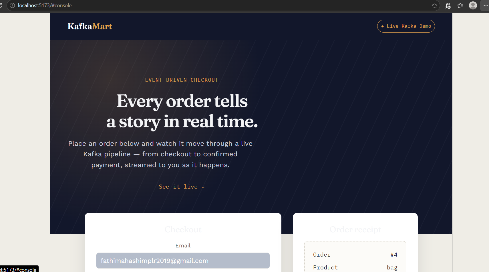
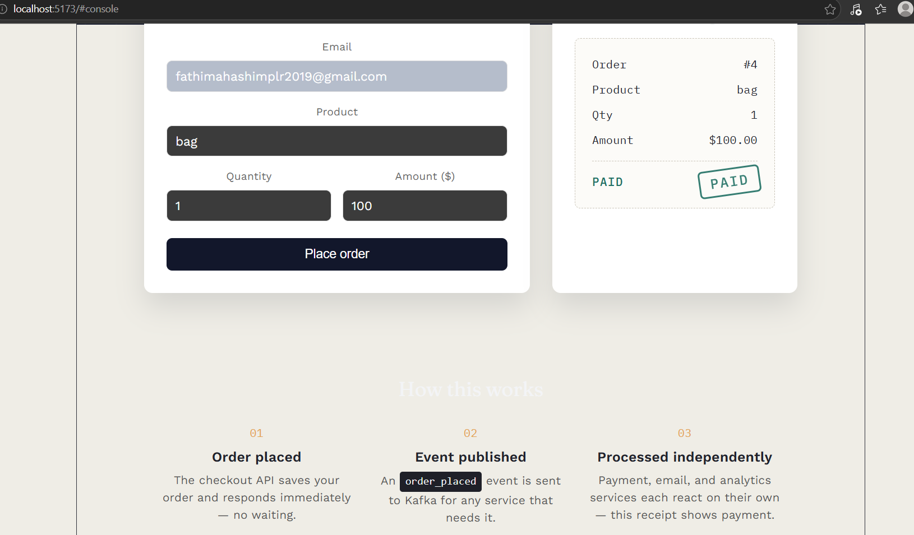
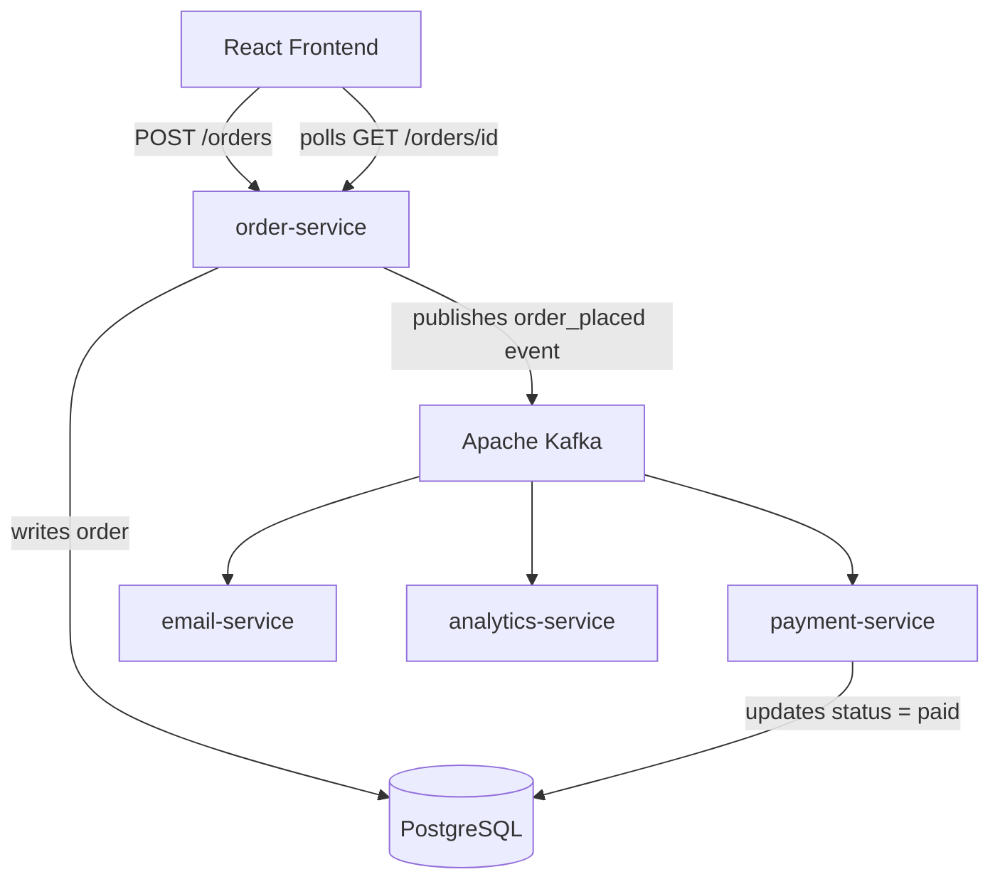

# Kafka E-Commerce Platform

An event-driven e-commerce backend built with **FastAPI**, **Apache Kafka**, and **PostgreSQL** — orders are processed asynchronously across independent microservices, with a live React dashboard showing orders move through the pipeline in real time.

---

## Screenshots

**Order placed — processing asynchronously via Kafka**


**Order confirmed — payment processed independently, status updated live**


---

## Why this project exists

Most CRUD portfolio projects call a database and return a response — nothing else happens. This project demonstrates a different pattern: **asynchronous, event-driven processing**, the same architectural approach used by real e-commerce and fintech systems at scale (Amazon, Uber, and Netflix all use Kafka for exactly this reason).

When an order is placed, the API responds **instantly** — it doesn't wait for payment, email, or analytics to finish. Those three concerns run independently, triggered by a Kafka event, and can each fail, scale, or deploy without affecting the others.

## Architecture



**The flow:**
1. Customer places an order through the React UI.
2. `order-service` saves the order to PostgreSQL and publishes an `order_placed` event to Kafka — then responds immediately.
3. `payment-service`, `email-service`, and `analytics-service` each independently consume that event and do their own work, at their own pace, in their own process.
4. `payment-service` updates the order's status in PostgreSQL once processing completes.
5. The frontend polls the order's status and updates live — no page refresh needed.

## Tech stack

| Layer | Technology |
|---|---|
| API | FastAPI (Python) |
| Messaging | Apache Kafka (hosted on Aiven) |
| Database | PostgreSQL (hosted on Neon) |
| Frontend | React + Vite |
| Deployment | Render (backend), Vercel (frontend) |

## Project structure

```
ecommerce-kafka/
├── 1-monolith/              # Baseline: same logic without Kafka (for comparison)
├── 2-microservices/
│   ├── order-service/       # FastAPI producer — creates orders, publishes events
│   ├── payment-service/     # Kafka consumer — processes payment, updates DB
│   ├── email-service/       # Kafka consumer — sends confirmation
│   └── analytics-service/   # Kafka consumer — logs order metrics
└── frontend/                 # React UI — checkout form + live order receipt
```

## Why a monolith folder exists

`1-monolith/` is intentionally included — it's the same order flow written as a single blocking process (calls payment, then email, then analytics, in sequence). It's there to make the before/after comparison explicit: run it and you'll see every request take 3+ seconds, and a single failing step break the whole request. That's the exact problem the Kafka-based microservices solve.

## Running it locally

**Prerequisites:** Python 3.11+, Node.js, Docker

**1. Start Kafka and PostgreSQL:**
```bash
docker compose up -d
```

**2. Run each service** (separate terminal per service):
```bash
cd 2-microservices/order-service
python -m venv venv && venv\Scripts\activate  # or source venv/bin/activate on Mac/Linux
pip install -r requirements.txt
uvicorn main:app --reload --port 8001
```
Repeat for `payment-service`, `email-service`, `analytics-service` (each has its own `venv` and `requirements.txt`).

**3. Run the frontend:**
```bash
cd frontend
npm install
npm run dev
```

**4. Configure environment variables**

Each service needs a `.env` file with your own Kafka and PostgreSQL credentials — these are never committed to this repo. Required variables per service:

```
KAFKA_HOST=your-kafka-host
KAFKA_PORT=your-kafka-port
KAFKA_USERNAME=your-username
KAFKA_PASSWORD=your-password
DATABASE_URL=your-postgresql-connection-string
```

## What I'd add next

- Dead-letter queue handling for failed payment events
- Idempotency keys to guard against duplicate event processing
- Admin dashboard showing all orders and per-service health
- Kafka cluster (multi-broker) for production-grade fault tolerance

## Author

**Fathima Hashim**
[GitHub](https://github.com/fathimahashim) · [LinkedIn](https://linkedin.com/in/fathima-hashim-585274238)
